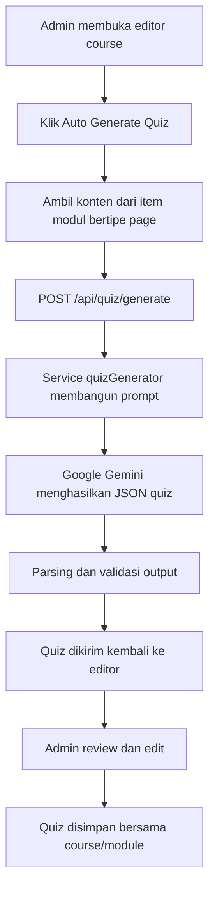

# Naskah Jurnal Draft

## Judul
Implementasi Auto-Generation Quiz Berbasis Google Gemini pada Platform E-Learning AWS Inovasi untuk Meningkatkan Efisiensi Waktu, Akurasi, dan Kualitas Soal

## Abstrak
Perkembangan artificial intelligence membuka peluang baru dalam otomasi penyusunan evaluasi pembelajaran, terutama pada pembuatan soal pilihan ganda di platform e-learning. Penelitian ini mengembangkan fitur auto-generation quiz berbasis Google Gemini pada platform e-learning AWS Inovasi yang dibangun dengan arsitektur full-stack Next.js dan Supabase. Objek penelitian adalah platform AWS Inovasi sebagai artefak digital pembelajaran yang memuat manajemen kursus, konten modular, pelacakan progres, dan sertifikat digital. Kebaruan penelitian ini terletak pada integrasi Google Gemini ke dalam alur penyusunan quiz yang mengambil konten dari item modul bertipe page pada editor admin, kemudian hasil generasinya ditinjau kembali oleh admin sebelum disimpan ke struktur course. Penelitian ini menggunakan Design Science Research Methodology (DSRM) yang meliputi identifikasi masalah, penetapan tujuan solusi, desain dan pengembangan artefak, demonstrasi, evaluasi, dan komunikasi hasil. Evaluasi dirancang melalui perbandingan waktu penyusunan quiz manual dan otomatis, validasi kesesuaian isi soal oleh ahli materi, serta penilaian kualitas soal dari aspek relevansi, kejelasan, dan validitas isi. Draft ini menunjukkan bahwa integrasi AI pada platform e-learning berpotensi meningkatkan efisiensi penyusunan soal tanpa mengorbankan kualitas evaluasi pembelajaran.

## Kata Kunci
E-learning, automatic item generation, Google Gemini, DSRM, quiz otomatis

## 1. Pendahuluan
Transformasi digital dalam pendidikan mendorong platform e-learning menjadi komponen penting dalam proses pembelajaran modern. Sistem e-learning tidak hanya berfungsi sebagai media distribusi materi, tetapi juga sebagai sarana interaksi, asesmen, dan pemantauan hasil belajar. Salah satu elemen terpenting dalam e-learning adalah quiz atau evaluasi pembelajaran yang digunakan untuk mengukur pemahaman peserta didik terhadap materi yang telah dipelajari.

Penyusunan quiz secara manual masih memiliki beberapa kendala, terutama dari sisi waktu, konsistensi kualitas, dan ketergantungan pada keahlian penyusun soal. Dalam konteks assessment, automatic item generation (AIG) telah lama dipandang sebagai pendekatan yang menjanjikan untuk mempercepat produksi butir soal. Gierl et al. (2012) menunjukkan bahwa AIG dapat digunakan untuk menghasilkan soal pilihan ganda secara lebih efisien, sementara Gierl et al. (2013) menekankan bahwa kualitas item tetap harus divalidasi agar hasil generasi tetap layak digunakan. Studi lain juga menegaskan bahwa kualitas distractor, desain model kognitif, dan validitas isi merupakan faktor penting dalam pengembangan item otomatis (Haladyna et al., 2002; Pugh et al., 2016; Gierl & Bulut, 2016).

Kemunculan large language model (LLM) seperti Google Gemini memperluas kemungkinan otomasi penyusunan soal berbasis konteks materi. Berbeda dengan pendekatan template murni, LLM memungkinkan sistem memahami input teks pembelajaran dan menghasilkan pertanyaan secara lebih fleksibel. Namun, penggunaan model generatif juga memunculkan risiko hallucination, bias, dan keluaran yang kurang selaras dengan sumber materi apabila tidak dibatasi oleh prompt dan validasi yang tepat (Zuckerman et al., 2023; Laupichler et al., 2023; Ngo et al., 2023). Oleh karena itu, penelitian yang menggabungkan implementasi teknis dan evaluasi terukur menjadi penting.

Platform e-learning AWS Inovasi pada penelitian ini telah menyediakan manajemen kursus, pembelajaran modular, progres belajar, dan sistem sertifikat otomatis. Namun, proses pembuatan quiz masih menjadi aktivitas yang berpotensi memakan waktu bagi admin atau pengelola materi. Berdasarkan kondisi tersebut, penelitian ini memfokuskan pengembangan fitur auto-generation quiz berbasis Google Gemini pada platform AWS Inovasi dengan tujuan meningkatkan efisiensi waktu, akurasi, dan kualitas soal.

### 1.1 Rumusan Masalah
1. Bagaimana implementasi auto-generation quiz berbasis Google Gemini pada platform e-learning AWS Inovasi?
2. Seberapa besar efisiensi waktu yang dihasilkan oleh pembuatan quiz otomatis dibandingkan pembuatan quiz manual?
3. Seberapa akurat soal yang dihasilkan AI dalam kesesuaian dengan materi pembelajaran?
4. Bagaimana kualitas soal hasil generasi AI ditinjau dari relevansi, kejelasan, dan validitas isi?

### 1.2 Tujuan Penelitian
1. Mengimplementasikan fitur auto-generation quiz berbasis Google Gemini pada platform AWS Inovasi.
2. Mengukur efisiensi waktu pembuatan quiz otomatis dibandingkan pembuatan manual.
3. Menguji akurasi kesesuaian soal AI terhadap materi pembelajaran.
4. Menilai kualitas soal yang dihasilkan berdasarkan aspek relevansi, kejelasan, dan validitas.

### 1.3 Kebaruan Penelitian
Kebaruan penelitian ini terletak pada integrasi Google Gemini ke dalam alur auto-generation quiz yang terhubung langsung dengan konten modul pada platform e-learning AWS Inovasi, dengan pendekatan human-in-the-loop agar hasil generasi AI tetap diverifikasi oleh pengelola materi sebelum digunakan. Kontribusi utamanya bukan hanya pada penggunaan AI untuk menghasilkan soal, tetapi pada rancangan pipeline end-to-end yang mencakup pengambilan konten dari item modul, penyusunan prompt terstruktur, generasi soal pilihan ganda, parsing JSON, validasi hasil, dan penyimpanan quiz ke struktur data course. Kebaruan ini kemudian diuji melalui tiga parameter yang terukur, yaitu efisiensi waktu, akurasi kesesuaian terhadap materi, dan kualitas soal.

## 2. Tinjauan Pustaka
E-learning merupakan bentuk pembelajaran berbasis teknologi yang memungkinkan distribusi materi, interaksi, evaluasi, dan pelacakan aktivitas dilakukan secara digital. Learning Management System (LMS) berperan sebagai pusat pengelolaan materi, evaluasi, dan laporan hasil belajar. Dalam penelitian ini, AWS Inovasi diposisikan sebagai LMS yang mengelola kursus, modul, konten, quiz, progres belajar, dan sertifikat digital.

Automatic item generation (AIG) merupakan pendekatan untuk menghasilkan butir soal secara otomatis dari struktur pengetahuan, model kognitif, atau prompt yang terdefinisi dengan baik. Gierl et al. (2012) menunjukkan bahwa AIG mampu mempercepat pembuatan item, sedangkan Gierl et al. (2013) menegaskan pentingnya validasi kualitas hasil generasi. Pugh et al. (2016) menunjukkan bahwa model kognitif dapat digunakan untuk menghasilkan soal yang lebih berkualitas. Selanjutnya, Pugh et al. (2020) mengonfirmasi bahwa AIG dapat dipakai untuk soal yang menguji aplikasi pengetahuan, namun tetap memerlukan evaluasi yang ketat.

Pemanfaatan AI generatif dalam pendidikan berkembang pesat, terutama setelah munculnya model bahasa besar. Zuckerman et al. (2023) menunjukkan bahwa ChatGPT dapat membantu penyusunan assessment writing, tetapi tetap memerlukan pengawasan. Laupichler et al. (2023) membandingkan soal ujian hasil AI dan manusia dan menemukan bahwa kualitas tetap menjadi isu penting. Ngo et al. (2023) menunjukkan bahwa ChatGPT 3.5 belum konsisten dalam menulis soal pilihan ganda yang sesuai. Lee et al. (2023) dan Han et al. (2023) juga menekankan bahwa penggunaan model generatif dalam pendidikan harus dilakukan dengan kehati-hatian.

Kualitas soal pilihan ganda umumnya diukur dari relevansi terhadap materi, kejelasan redaksi, satu jawaban benar, dan kualitas distractor. Haladyna et al. (2002) memberikan pedoman umum penulisan item pilihan ganda yang baik, sedangkan Gierl dan Bulut (2016) menyoroti bahwa karakteristik psikometrik item hasil generasi tetap harus diuji. Tarrant et al. (2008) menunjukkan bahwa kesalahan penulisan item dapat memengaruhi kualitas asesmen secara signifikan.

AI berpotensi meningkatkan efisiensi kerja pendidik dalam penyusunan soal. Kosh et al. (2019) menyoroti pentingnya analisis cost-benefit pada AIG, sedangkan Kıyak et al. (2024) menunjukkan bahwa AI dapat digunakan untuk mempercepat pembuatan soal yang efektif. Dalam konteks penelitian ini, efisiensi waktu menjadi parameter penting karena tujuan sistem bukan hanya menghasilkan soal, tetapi juga mengurangi beban kerja admin atau pengelola materi.

DSRM merupakan metode penelitian yang tepat untuk pengembangan artefak sistem informasi. Hevner et al. (2004) menjelaskan bahwa design science berfokus pada solusi yang berguna bagi masalah nyata. Peffers et al. (2008) merumuskan tahapan DSRM yang terdiri atas identifikasi masalah, tujuan solusi, desain dan pengembangan, demonstrasi, evaluasi, dan komunikasi. Geerts dan McCarthy (2011) serta Miah dan Genemo (2016) menunjukkan bahwa DSRM cocok untuk pengembangan sistem yang memiliki artefak teknis dan kontribusi praktis.

## 3. Metode Penelitian
Penelitian ini menggunakan Design Science Research Methodology (DSRM) karena fokus utamanya adalah merancang, membangun, dan mengevaluasi artefak berupa fitur auto-generation quiz berbasis Google Gemini pada platform e-learning AWS Inovasi. Pendekatan ini sesuai untuk menghasilkan solusi yang aplikatif dan terukur bagi permasalahan riil dalam sistem informasi.

### 3.1 Tahapan DSRM
Tahap penelitian disusun mengikuti enam langkah DSRM. Pertama, identifikasi masalah dilakukan dengan menelaah proses pembuatan quiz manual yang memerlukan waktu dan tenaga. Kedua, tujuan solusi ditetapkan, yaitu membangun fitur otomatis yang mampu menghasilkan soal dari konten pembelajaran. Ketiga, desain dan pengembangan artefak dilakukan pada arsitektur Next.js dan Supabase dengan komponen AutoQuizGenerator pada sisi admin, hook pemanggilan data di sisi klien, route handler API sebagai penghubung, dan service layer sebagai pembangun prompt ke Google Gemini. Keempat, demonstrasi dilakukan dengan memasukkan konten pembelajaran dari item modul bertipe page ke sistem untuk menghasilkan quiz. Kelima, evaluasi dilakukan melalui perbandingan waktu penyusunan quiz, validasi kesesuaian isi, dan penilaian kualitas soal. Keenam, komunikasi hasil dilakukan melalui penulisan naskah ilmiah.

### 3.2 Arsitektur dan Workflow Implementasi
Arsitektur implementasi fitur auto-generation quiz pada platform AWS Inovasi dapat diringkas sebagai berikut.

Workflow tersebut penting dijelaskan dalam naskah karena menunjukkan bahwa fitur ini tidak berhenti pada generasi AI, tetapi tetap melibatkan validasi manusia sebelum hasil akhir dipakai di sistem.

### 3.3 Objek Penelitian
Objek penelitian adalah platform e-learning AWS Inovasi, khususnya fitur auto-generation quiz yang memanfaatkan Google Gemini untuk mengolah konten pembelajaran menjadi soal pilihan ganda.

### 3.4 Teknik Pengumpulan Data
Data penelitian dikumpulkan melalui observasi alur kerja pembuatan quiz pada platform, dokumentasi proses implementasi fitur quiz generator, pengukuran waktu pembuatan quiz manual dan otomatis, serta penilaian ahli terhadap akurasi dan kualitas soal.

### 3.5 Teknik Analisis Data
Analisis data dilakukan secara deskriptif kuantitatif dan kualitatif. Waktu pembuatan quiz dianalisis dengan membandingkan metode manual dan otomatis. Akurasi dan kualitas soal dianalisis melalui skor penilaian ahli terhadap relevansi, kejelasan, dan validitas isi.

### 3.6 Indikator Keberhasilan
Fitur dianggap berhasil apabila mampu mempercepat penyusunan quiz, menghasilkan soal yang sesuai dengan materi, dan memiliki kualitas yang layak untuk digunakan pada evaluasi pembelajaran.

## 4. Hasil dan Pembahasan
Bagian ini disiapkan untuk menampung hasil uji empiris dari implementasi fitur auto-generation quiz. Secara prinsip, isi bagian ini memang setara dengan Bab 4 pada format skripsi/tesis, tetapi dalam format jurnal biasanya ditulis sebagai bagian "Hasil dan Pembahasan". Untuk memperkuat bukti implementasi, disarankan menambahkan tangkapan layar tampilan fitur pada editor admin.

Contoh gambar yang sebaiknya disertakan:

- Gambar tampilan tombol Auto Generate Quiz pada halaman admin course editor.
- Gambar pengaturan jumlah soal, tingkat kesulitan, dan bahasa sebelum proses generate.
- Gambar hasil quiz yang sudah di-generate sebelum disimpan atau diedit manual.

Contoh penamaan gambar:

- Gambar 4.1 Tampilan fitur Auto Generate Quiz pada editor course.
- Gambar 4.2 Hasil generasi quiz menggunakan Google Gemini.

### 4.1 Hasil Uji Efisiensi Waktu
Bagian ini memuat perbandingan waktu pembuatan quiz secara manual dan otomatis. Data yang ditulis sebaiknya berasal dari beberapa skenario uji, misalnya per modul atau per jumlah soal tertentu.

| Skenario Uji | Jumlah Soal | Waktu Manual (menit) | Waktu Otomatis (menit) | Selisih Waktu (menit) | Persentase Efisiensi (%) | Catatan |
| --- | --- | --- | --- | --- | --- | --- |
| Modul 1 |  |  |  |  |  |  |
| Modul 2 |  |  |  |  |  |  |
| Modul 3 |  |  |  |  |  |  |
| Rata-rata |  |  |  |  |  |  |

Rumus yang dapat dipakai untuk menghitung efisiensi waktu:

$$
	ext{Efisiensi Waktu} = \frac{\text{Waktu Manual} - \text{Waktu Otomatis}}{\text{Waktu Manual}} \times 100\%
$$

### 4.2 Hasil Uji Kualitas Soal
Bagian ini memuat hasil penilaian kualitas soal oleh ahli materi atau reviewer. Jika memungkinkan, gunakan dua penilai atau lebih agar hasilnya lebih kuat.

| ID Soal | Kesesuaian Materi (1-5) | Kejelasan Bahasa (1-5) | Satu Jawaban Benar (Ya/Tidak) | Kualitas Distractor (1-5) | Kelayakan Akhir (Layak/Revisi) | Saran Perbaikan |
| --- | --- | --- | --- | --- | --- | --- |
| Soal 1 |  |  |  |  |  |  |
| Soal 2 |  |  |  |  |  |  |
| Soal 3 |  |  |  |  |  |  |
| Soal 4 |  |  |  |  |  |  |
| Soal 5 |  |  |  |  |  |  |

Jika memakai lebih dari satu penilai, tabel ringkas berikut juga bisa ditambahkan.

| Penilai | Jumlah Soal Dinilai | Rata-rata Skor Kesesuaian | Rata-rata Skor Kejelasan | Persentase Soal Layak Pakai |
| --- | --- | --- | --- | --- |
| Ahli 1 |  |  |  |  |
| Ahli 2 |  |  |  |  |
| Ahli 3 |  |  |  |  |

### 4.3 Hasil Uji Akurasi Kesesuaian dengan Materi
Bagian ini dipakai untuk menunjukkan seberapa banyak soal yang benar-benar sesuai dengan materi modul sumber. Jika ada, sertakan kategori seperti "sesuai", "cukup sesuai", dan "tidak sesuai".

| Modul | Jumlah Soal Dihasilkan | Sesuai | Cukup Sesuai | Tidak Sesuai | Persentase Kesesuaian (%) |
| --- | --- | --- | --- | --- | --- |
| Modul 1 |  |  |  |  |  |
| Modul 2 |  |  |  |  |  |
| Modul 3 |  |  |  |  |  |
| Total/Rata-rata |  |  |  |  |  |

### 4.4 Pembahasan
Setelah tabel diisi, bagian pembahasan perlu menjelaskan arti data tersebut. Misalnya, apakah efisiensi waktu memang signifikan, apakah kualitas soal sudah memenuhi standar minimum, dan bagian mana yang masih perlu diperbaiki. Pembahasan juga perlu menghubungkan hasil dengan penelitian terdahulu tentang automatic item generation, validasi ahli, dan penggunaan AI generatif pada pendidikan.

Secara konseptual, kontribusi utama penelitian ini ada pada tiga aspek. Pertama, aspek teknis karena fitur AI diintegrasikan ke platform e-learning yang nyata. Kedua, aspek efisiensi karena waktu penyusunan quiz diukur secara langsung dan dibandingkan dengan metode manual. Ketiga, aspek kualitas karena hasil generasi diuji terhadap kesesuaian materi dan standar penyusunan item pilihan ganda.

## 5. Kesimpulan
Penelitian ini mengusulkan implementasi auto-generation quiz berbasis Google Gemini pada platform e-learning AWS Inovasi dengan metode DSRM. Fokus penelitian diarahkan pada efisiensi waktu, akurasi, dan kualitas soal. Kebaruan penelitian terletak pada integrasi Google Gemini ke dalam editor course yang operasional, dengan alur kerja yang tetap memberi ruang review dan penyuntingan oleh admin sebelum quiz digunakan. Draft ini masih perlu dilanjutkan dengan pengambilan data empiris, validasi ahli, dan penyesuaian format akhir sesuai template jurnal tujuan.

## Daftar Pustaka
Falcão, D., et al. (2022). Feasibility assurance: a review of automatic item generation in medical assessment. *Advances in Health Sciences Education, 27*, 405-429. https://doi.org/10.1007/s10459-022-10092-z

Geerts, G. L., & McCarthy, W. E. (2011). A design science research methodology and its application to accounting information systems research. *International Journal of Accounting Information Systems, 12*(2), 142-151. https://doi.org/10.1016/j.accinf.2011.02.004

Gierl, M. J., Lai, H., & Alves, C. (2013). Evaluating the quality of medical multiple-choice items created with automated generation processes. *Medical Education, 47*(7), 726-738. https://doi.org/10.1111/medu.12202

Gierl, M. J., & Bulut, O. (2016). Evaluating the psychometric characteristics of generated multiple-choice test items. *Applied Measurement in Education, 29*(3), 196-206. https://doi.org/10.1080/08957347.2016.1171768

Gierl, M. J., & Lai, H. (2013). Using automated processes to generate test items. *Educational Measurement: Issues and Practice, 32*(2), 36-46. https://doi.org/10.1111/emip.12018

Gierl, M. J., Lai, H., & Turner, S. (2012). Using automatic item generation to create multiple-choice test items. *Medical Education, 46*(8), 757-765. https://doi.org/10.1111/j.1365-2923.2012.04289.x

Han, J., et al. (2023). An explorative assessment of ChatGPT as an aid in medical education: Use it with caution. *Medical Teacher, 45*(5), 657-665. https://doi.org/10.1080/0142159X.2023.2271159

Haladyna, T. M., Downing, S. M., & Rodriguez, M. C. (2002). A review of multiple-choice item-writing guidelines for classroom assessment. *Applied Measurement in Education, 15*(3), 309-333. https://doi.org/10.1207/S15324818AME1503_5

Hevner, A. R., March, S. T., Park, J., & Ram, S. (2004). Design science in information systems research. *MIS Quarterly, 28*(1), 75-105. https://doi.org/10.2307/25148625

Kıyak, Y. S., et al. (2024). Case-based MCQ generator: A custom ChatGPT based on published prompts in the literature for automatic item generation. *Medical Teacher, 46*(8), 847-856. https://doi.org/10.1080/0142159X.2024.2314723

Kıyak, Y. S., et al. (2024). Twelve tips to leverage AI for efficient and effective medical question generation: A guide for educators using ChatGPT. *Medical Teacher, 46*(8), 1021-1032. https://doi.org/10.1080/0142159X.2023.2294703

Kıyak, Y. S., & Kononowicz, A. A. (2025). Using a hybrid of AI and template-based method in automatic item generation to create multiple-choice questions in medical education: Hybrid AIG. *JMIR Formative Research, 9*, e65726. https://doi.org/10.2196/65726

Kosh, S., et al. (2019). A cost-benefit analysis of automatic item generation. *Educational Measurement: Issues and Practice, 38*(1), 48-58. https://doi.org/10.1111/emip.12237

Laupichler, M. C., et al. (2023). Large language models in medical education: comparing ChatGPT- to human-generated exam questions. *Academic Medicine, 99*(5), 508-516. https://doi.org/10.1097/ACM.0000000000005626

Lee, A., et al. (2023). The rise of ChatGPT: exploring its potential in medical education. *Anatomical Sciences Education, 17*(5), 926-934. https://doi.org/10.1002/ase.2270

Leslie, T., & Gierl, M. J. (2023). Using automatic item generation to create multiple-choice questions for pharmacy assessment. *American Journal of Pharmaceutical Education, 87*(10), 100081. https://doi.org/10.1016/j.ajpe.2023.100081

Miah, S., & Genemo, H. (2016). A design science research methodology for expert systems development. *Australasian Journal of Information Systems, 20*, 1-19. https://doi.org/10.3127/ajis.v20i0.1329

Ngo, A., et al. (2023). ChatGPT 3.5 fails to write appropriate multiple choice practice exam questions. *Academic Pathology, 11*, 100099. https://doi.org/10.1016/j.acpath.2023.100099

Peffers, K., Tuunanen, T., Rothenberger, M. A., & Chatterjee, S. (2008). A design science research methodology for information systems research. *Journal of Management Information Systems, 24*(3), 45-77. https://doi.org/10.2753/MIS0742-1222240302

Pugh, D., Ralston, P. A. S., Seifert, C. M., & Choi, I. (2016). Using cognitive models to develop quality multiple-choice questions. *Medical Teacher, 38*(8), 838-845. https://doi.org/10.3109/0142159X.2016.1150989

Pugh, D., Ralston, P. A. S., Seifert, C. M., & Choi, I. (2020). Can automated item generation be used to develop high quality MCQs that assess application of knowledge? *Research and Practice in Technology Enhanced Learning, 15*(1), 12. https://doi.org/10.1186/s41039-020-00134-8

Sayin, A., & Zeybek, G. (2025). Using OpenAI GPT to generate reading comprehension items. *Educational Measurement: Issues and Practice, 43*(1), 5-16. https://doi.org/10.1111/emip.12590

Tarrant, M., Knierim, A., Hayes, S. K., & Ware, J. (2008). The frequency of item writing flaws in multiple-choice questions used in high stakes nursing assessments. *Nurse Education Today, 28*(8), 198-205. https://doi.org/10.1111/j.1365-2923.2007.02957.x

Wieringa, R. J. (2014). Research design. In *Design science methodology for information systems and software engineering* (pp. 121-133). Springer. https://doi.org/10.1007/978-3-662-43839-8_11

Wieringa, R. J. (2014). Research goals and research questions. In *Design science methodology for information systems and software engineering* (pp. 13-23). Springer. https://doi.org/10.1007/978-3-662-43839-8_2

Zuckerman, C., et al. (2023). ChatGPT for assessment writing. *Medical Teacher, 45*(11), 1224-1231. https://doi.org/10.1080/0142159X.2023.2249239
